<div class="MCWHeader1">
Migrating SQL databases to Azure
</div>

<div class="MCWHeader2">
Before the hands-on lab setup guide
</div>

<div class="MCWHeader3">
October 2021
</div>

Information in this document, including URL and other Internet Web site references, is subject to change without notice. Unless otherwise noted, the example companies, organizations, products, domain names, e-mail addresses, logos, people, places, and events depicted herein are fictitious, and no association with any real company, organization, product, domain name, e-mail address, logo, person, place or event is intended or should be inferred. Complying with all applicable copyright laws is the responsibility of the user. Without limiting the rights under copyright, no part of this document may be reproduced, stored in or introduced into a retrieval system, or transmitted in any form or by any means (electronic, mechanical, photocopying, recording, or otherwise), or for any purpose, without the express written permission of Microsoft Corporation.

Microsoft may have patents, patent applications, trademarks, copyrights, or other intellectual property rights covering subject matter in this document. Except as expressly provided in any written license agreement from Microsoft, the furnishing of this document does not give you any license to these patents, trademarks, copyrights, or other intellectual property.

The names of manufacturers, products, or URLs are provided for informational purposes only and Microsoft makes no representations and warranties, either expressed, implied, or statutory, regarding these manufacturers or the use of the products with any Microsoft technologies. The inclusion of a manufacturer or product does not imply endorsement of Microsoft of the manufacturer or product. Links may be provided to third party sites. Such sites are not under the control of Microsoft and Microsoft is not responsible for the contents of any linked site or any link contained in a linked site, or any changes or updates to such sites. Microsoft is not responsible for webcasting or any other form of transmission received from any linked site. Microsoft is providing these links to you only as a convenience, and the inclusion of any link does not imply endorsement of Microsoft of the site or the products contained therein.

© 2021 Microsoft Corporation. All rights reserved.

Microsoft and the trademarks listed at <https://www.microsoft.com/en-us/legal/intellectualproperty/Trademarks/Usage/General.aspx> are trademarks of the Microsoft group of companies. All other trademarks are property of their respective owners.

**Contents**

<!-- TOC -->

- [Migrating SQL databases to Azure before the hands-on lab setup guide](#migrating-sql-databases-to-azure-before-the-hands-on-lab-setup-guide)
  - [Requirements](#requirements)
  - [Before the hands-on lab](#before-the-hands-on-lab)
    - [Task 1: Create a resource group](#task-1-create-a-resource-group)
    - [Task 2: Register the Microsoft DataMigration resource provider](#task-2-register-the-microsoft-datamigration-resource-provider)
    - [Task 3: Validate subscription compatibility with SQL MI](#task-3-validate-subscription-compatibility-with-sql-mi)
    - [Task 4: Run ARM template to provision lab resources](#task-4-run-arm-template-to-provision-lab-resources)
    - [Task 5: Prepare the Jump Box](#task-5-prepare-the-jump-box)
    - [Task 6: Install DMA on the SQL Server 2008 VM](#task-6-install-dma-on-the-sql-server-2008-vm)
    - [Task 7: Configure the WideWorldImporters database on the SqlServer2008 VM](#task-7-configure-the-wideworldimporters-database-on-the-sqlserver2008-vm)
      - [Restore database](#restore-database)
      - [Configure database user and service](#configure-database-user-and-service)

<!-- /TOC -->

# Migrating SQL databases to Azure before the hands-on lab setup guide

## Requirements

- Microsoft Azure subscription must be pay-as-you-go or MSDN.
  - Trial subscriptions will _not_ work.

> **Important**: You must have sufficient rights within your Azure AD tenant to create an Azure Active Directory application and service principal and assign roles on your subscription to complete this hands-on lab.

## Before the hands-on lab

Duration: 15 minutes

In this exercise, you set up your environment for use in the rest of the hands-on lab. You should follow all steps provided _before_ attending the Hands-on lab.

> **Important**: Many Azure resources require globally unique names. Throughout these steps, the word "SUFFIX" appears as part of resource names. You should replace this with your Microsoft alias, initials, or other value to ensure uniquely named resources.

### Task 1: Create a resource group

1. In the [Azure portal](https://portal.azure.com), select **Resource groups** from the Azure services list.

   

2. On the Resource groups blade, select **+ Create**.

   

3. On the Create a resource group **Basics** tab, enter the following:

   - **Subscription**: Select the subscription you are using for this hands-on lab.
   - **Resource group**: Enter `hands-on-lab-SUFFIX` as the name of the new resource group.
   - **Region**: Select the region you are using for this hands-on lab.

   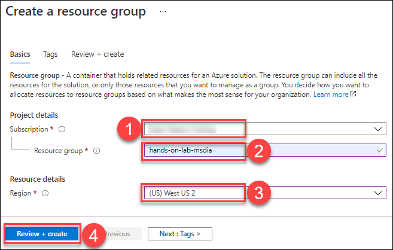

4. Select **Review + Create**.

5. On the **Review + create** tab, ensure the Validation passed message is displayed and then select **Create**.

### Task 2: Register the Microsoft DataMigration resource provider

In this task, you register the `Microsoft.DataMigration` resource provider with your Azure subscription. Registration of this resource provider is necessary to create an Azure Database Migration Service within your subscription.

1. In the [Azure portal](https://portal.azure.com), from the **home page**, select **Subscriptions** from the Azure services list.

   

2. Select the subscription you are using for this hands-on lab from the list.

   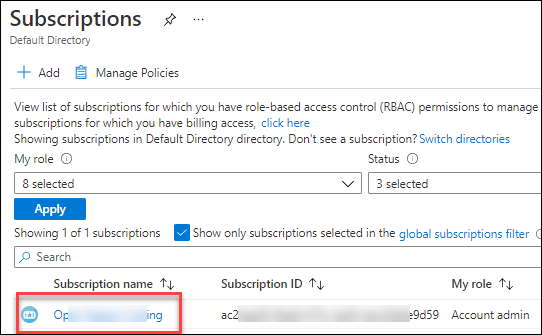

3. On the Subscription blade, select **Resource providers** from the left-hand menu and then enter "migration" into the filter box.

   

4. If the `Microsoft.DataMigration` provider's status is `NotRegistered`, select **Register** in the toolbar.

   

5. It can take a couple of minutes for the registration to complete. Make sure you see the status set to **Registered** before moving on. You may need to select **Refresh** on the toolbar to see the updated status.

   

### Task 3: Validate subscription compatibility with SQL MI

Before running the ARM template, it is beneficial to quickly verify that you can provision SQL Managed Instance in your subscription.

1. In the [Azure portal](https://portal.azure.com), select **+Create a resource**.

   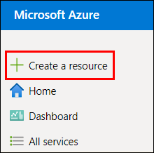

2. Enter **sql managed instance** into the Search the Marketplace box.
3. Then select **Azure SQL Managed Instance** from the results.

   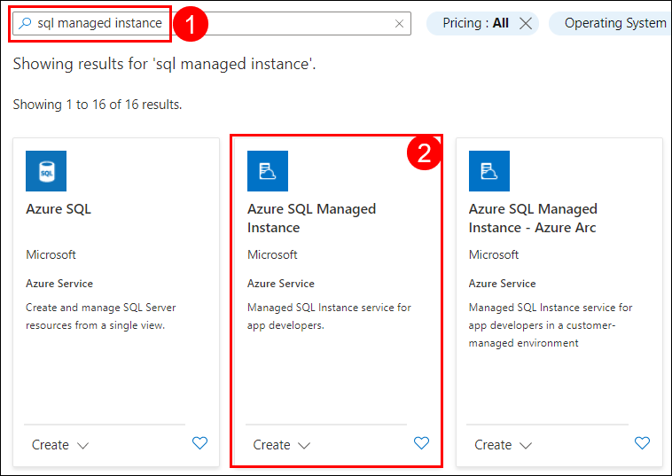

4. Select **Create** on the Azure SQL Managed Instance blade.

   

5. On the SQL managed instance blade, look for a message stating that "Managed instance creation is not available for the chosen subscription type...", which will be displayed near the bottom of the SQL managed instance blade.

   

   > **Note**: If you see the message stating that Managed Instance creation is not available for the chosen subscription type, follow the instructions for [obtaining a larger quota for SQL Managed Instance](https://docs.microsoft.com/azure/sql-database/sql-database-managed-instance-resource-limits#obtaining-a-larger-quota-for-sql-managed-instance) before proceeding with the following steps.

6. Be happy if you don't have any warnings! Just **cancel** the current operation by closing the blade.

   

### Task 4: Run ARM template to provision lab resources

In this task, you run an Azure Resource Manager (ARM) template to create the resources required for this hands-on lab. The components are deployed inside a new virtual network (VNet) to facilitate communication between the VMs and SQL MI. The ARM template also adds inbound and outbound security rules to the network security groups associated with SQL MI and the VMs, including opening port 3389 to allow RDP connections to the JumpBox. The resources created by the ARM template include:

- A virtual network with three subnets, ManagedInstance, Management, and a Gateway subnet.
- A virtual network gateway associated with the Gateway subnet.
- A route table.
- Azure SQL Managed Instance (SQL MI), added to the ManagedInstance subnet.
- A JumpBox with Visual Studio 2019 Community Edition
- A SQL Server 2008 R2 VM added to the Management subnet.
- Azure Database Migration Service (DMS).
- Azure App Service Plan and App Service (Web App).
- Azure Blob Storage account.

> **Note**: You can review the steps to manually provision and configure the lab resources in the [Manual resource setup guide](./Manual-resource-setup.md).

You are now ready to begin the ARM template deployment.

1. To open a custom deployment screen in the Azure portal, use Azure search bar and type **deploy**:
2. Select the **Deploy a custom template** service in search results.

   

   > **Note**: Running the ARM template occasionally results in a `ResourceDeploymentFailure` error, with a code of `VnetSubnetConflictedWithIntendedPolicy`. This error is not caused by an issue with the ARM template and appears to be the result of backend resource deployment issues in Azure. At this time, the workaround is first to try the deployment in a different region. If that does not work, try going through the [Manual resource setup guide](./Manual-resource-setup.md) to create the SQL MI database.

3. On the custom deployment screen, select the **Build your own template in the editor** button.

   

4. Use the **Load file** button or paste the contents of the file **Hands-on lab/lab-files/ARM-template/azure-deploy.json** from the repository.

5. Select the **Save** button to validate the template.

   

6. On the next custom deployment, check that **19 resources** are about to be created.

7. Only fill **two settings** into the deployment form, and **leave others as default**:

   - **Resource group**: Select the hands-on-lab-SUFFIX resource group from the dropdown list.
   - **Managed Instance Name**: Provide a globally unique value, such as **sqlmi-SUFFIX**.

8. Then select **Review + create** to review the custom deployment.

   

9. Wait for the **Review + create** blade to refresh, and ensure the _Validation passed_ message is displayed. Finally, select **Create** to begin the custom deployment.

   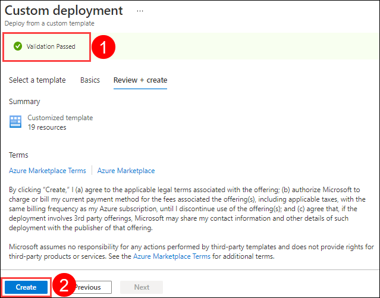

   > **Note**: The deployment of the custom ARM template can take over 4 hours due to the inclusion of SQL MI. However, the deployment of most of the resources completes within a few minutes. The JumpBox and SQL Server 2008 R2 VMs should finish in about 15 minutes.

10. You can monitor the deployment's progress any time by navigating to the **hands-on-lab-SUFFIX** resource group in the Azure portal and then selecting **Deployments** from the left-hand menu. The deployment is named **Microsoft.Template-xxxxxxx**. Select that to view the progress of each item in the template.

   

> Check back in a few hours to monitor the progress of your SQL MI provisioning. If the provisioning goes on for longer than 7 hours, you may need to issue a support ticket in the Azure portal to request the provisioning process be unblocked by Microsoft support.

### Task 5: Prepare the Jump Box

In this Task, you will install SQL Server Management Studio on the JumpBox. You will utilize this tool to manage the SQL Server 2008 R2 instance and eventually the SQL MI instance. You will also obtain a copy of the lab repository. 

1. On your JumpBox VM blade, select **Connect** and **RDP** from the top menu.

   

2. On the Connect with RDP blade, select **Download RDP File**, then open the downloaded RDP file.

   

3. Select **Connect** on the Remote Desktop Connection dialog.

   

4. Enter the following credentials when prompted, and then select **OK**:

   - **Username**: `sqlmiuser`
   - **Password**: Use the JumpBox secure password (`Password.1234567890`)

   

5. Select **Yes** to connect if you are prompted that the identity of the remote computer cannot be verified.

   

6. Once logged in, launch the **Server Manager**. This should start automatically, but you can access it via the Start menu if it does not.

7. Select **Local Server**, then select **On** next to **IE Enhanced Security Configuration**.

    

8. In the Internet Explorer Enhanced Security Configuration dialog, select **Off** under both Administrators and Users, and then select **OK**.

    

9. Open a web browser on your JumpBox, navigate to <https://docs.microsoft.com/en-us/sql/ssms/download-sql-server-management-studio-ssms> and then select the **Download SQL Server Management Studio (SSMS).x** link to download the latest version of SSMS.

   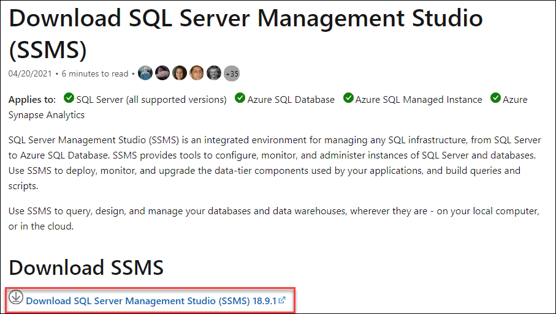

   > **Note**: Versions change frequently, so if the version number you see does not match the screenshot, download and install the most recent version.

10. Run the downloaded installer.

11. On the Welcome screen, select **Install** to begin the installation.

    

12. Select **Close** when the installation completes.

    

13. Download the lab starter solution from the [MCW Migrating SQL databases to Azure GitHub repo](https://github.com/microsoft/MCW-Migrating-SQL-databases-to-Azure/archive/master.zip).

14. If you receive a message that downloads are not allowed, select the Tools icon at the top right of the Internet Explorer browser window, and then select **Internet options** from the context menu.

    

15. In the **Internet Options** dialog, select **Custom level** in the Security level for this zone box.

    

16. In the Security Settings - Internet Zone dialog, locate the **Downloads** settings and choose **Enable**, then select **OK**.

    

17. Select **OK** on the Internet Options dialog, and then attempt the download again.

18. When prompted, choose to save the file and then select Open folder.

    

19. Once it is downloaded, extract the ZIP file to `C:\hands-on-lab`.

    

    > **Important**: Ensure you use the path above, or something similarly short. Failure to do so could result in errors opening some of the files due to a long file path.

### Task 6: Install DMA on the SQL Server 2008 VM

In this Task, you will install the Data Migration Assistant and .NET Framework 4.8, a dependency.

1. As you did for the JumpBox, navigate to the SqlServer2008 VM blade in the Azure portal, select **Overview** from the left-hand menu, and then select **Connect** and **RDP** on the top menu.

   

2. On the Connect with RDP blade, select **Download RDP File**, then open the downloaded RDP file.

3. Select **Connect** on the Remote Desktop Connection dialog.

   

4. Enter the following credentials when prompted, and then select **OK**:

   - **Username**: `sqlmiuser`
   - **Password**: Use the SqlServer2008 VM secure password (`Password.1234567890`)

   

5. Select **Yes** to connect, if prompted the identity of the remote computer cannot be verified.

   

6. Once logged in, launch the **Server Manager**. This should start automatically, but you can access it via the Start menu if it does not.

7. On the **Server Manager** view, select **Configure IE ESC** under Security Information.

   

8. In the Internet Explorer Enhanced Security Configuration dialog, select **Off** under both Administrators and Users, and then select **OK**.

   

9. Close the Server Manager, as you will proceed to install the Microsoft Data Migration Assistant v5.x.

10. As **Microsoft Data Migration Assistant** requires .NET Framework 4.8 to operate, install it from the [Microsoft Site](https://go.microsoft.com/fwlink/?linkid=2088631) by pasting `https://go.microsoft.com/fwlink/?linkid=2088631` into an Internet Explorer address bar.

11. **Download** and **Run** the installation package to proceed with new .NET Framework 4.8 setup.

12. Scroll down terms, **Accept** the license terms, and select **Install**.

    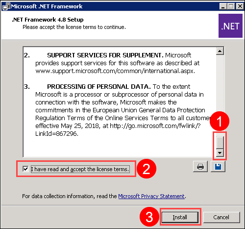

13. After framework setup, **restarting** the VM is required. Select **Restart now** when prompted, and wait a moment before connecting back to your VM. Generally, restarting takes less than two minutes.

    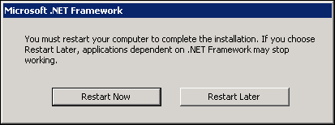

14. Install **Microsoft Data Migration Assistant** on your SqlSever2008 VM by accessing the [download page](https://www.microsoft.com/en-us/download/details.aspx?id=53595) with Internet Explorer.

15. Select **Download** to get the installation files.

    

16. Complete the download. Execute the downloaded file on the SQL Server 2008 R2 VM.

    

17. As with the previous installation, start by selecting **Next**. Scroll down the license terms, **Accept** them, and select the **Install** button.

### Task 7: Configure the WideWorldImporters database on the SqlServer2008 VM

In this task, you restore and configure the `WideWorldImporters` database on the SQL Server 2008 R2 instance.

#### Restore database

1. On the SqlServer2008 VM, download a [backup of the WideWorldImporters database](https://raw.githubusercontent.com/microsoft/Migrating-SQL-databases-to-Azure/master/Hands-on%20lab/lab-files/Database/WideWorldImporters.bak). Then save it to your `C:\Users\sqlmiuser\Downloads` of the VM, and copy the file to the  `D:\`.

    > **Note**: Accessing **Download** folder is not authorized from SQL Server Management Studio, while `D:\` is.
    > **Hint**: Copy file URL to VM using Internet Explorer: `https://raw.githubusercontent.com/microsoft/Migrating-SQL-databases-to-Azure/master/Hands-on%20lab/lab-files/Database/WideWorldImporters.bak`

2. Next, open **Microsoft SQL Server Management Studio 17** (SSMS) by entering **sql server** into the search bar in the Windows Start menu and selecting **Microsoft SQL Server Management Studio** from the search results.

   

3. In the SSMS **Connect to Server** dialog, enter **SQLSERVER2008** into the Server name box, ensure **Windows Authentication** is selected, and then select **Connect**.

   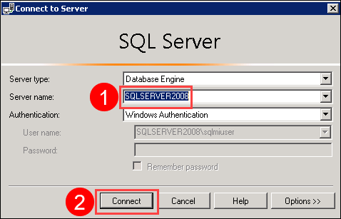

4. Once connected, right-click **Databases** under **SQLSERVER2008** in the Object Explorer, and then select **Restore Database** from the context menu.

   

5. You will now restore the `WideWorldImporters` database using the downloaded `WideWorldImporters.bak` file. On the **General** page of the Restore Database dialog, select **Device** under Source, and then select the Browse (`...`) button to the right of the Device box.

   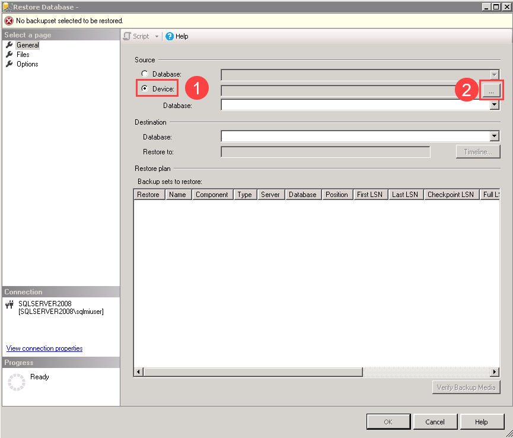

6. In the **Select backup devices** dialog that appears, select **Add**.

   

7. In the **Locate Backup File** dialog, browse to the location you saved the downloaded `WideWorldImporters.bak` file, select that file, and then select **OK**.

   

8. Select **OK** on the **Select backup devices** dialog. This returns you to the Restore Database dialog. The dialog now contains the information required to restore the `WideWorldImporters` database.

9. Select the restore checkmark. Select **WideWorldImporters** from the **Database** menu. Then, select **OK** to start to restore.

   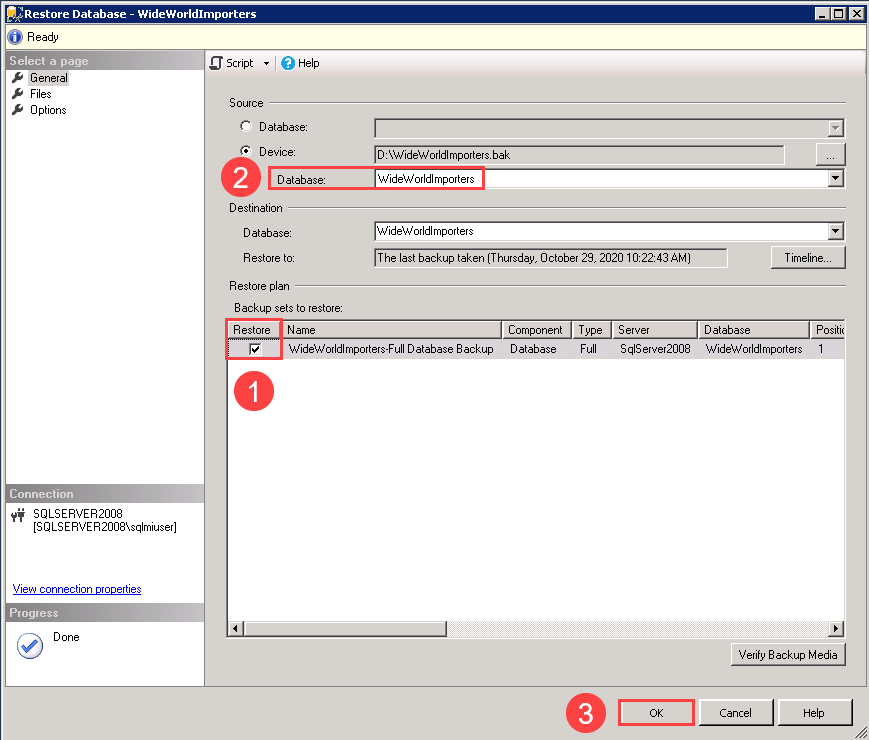

10. Select **OK** in the dialog when the database restore is complete.

    

#### Configure database user and service

1. Next, you execute a script in SSMS to create the `WorkshopUser` account. To create the script, open a new query window in SSMS by selecting **New Query** in the SSMS toolbar.

    

2. Copy and paste the SQL script below into the new query window:

   ```sql
   USE master;
   GO

   EXEC sp_addsrvrolemember
      @loginame = N'WorkshopUser',
      @rolename = N'sysadmin';
   GO

   -- Assign the user to the WideWorldImporters database
   USE WideWorldImporters;
   GO

   IF NOT EXISTS (SELECT * FROM sys.database_principals WHERE name = N'WorkshopUser')
   BEGIN
      CREATE USER [WorkshopUser] FOR LOGIN [WorkshopUser]
      EXEC sp_addrolemember N'db_datareader', N'WorkshopUser'
   END;
   GO
   ```

3. To run the script, select **Execute** from the SSMS toolbar.

    

4. Select **New Query** from the SSMS toolbar again.

    

5. Next, copy and paste the SQL script below into the new query window. This script enables Service broker on the `WideWorldImporters` database.

    ```sql
    USE [WideWorldImporters];
    GO

    -- Grant the sqlmiuser ALTER database permissions
    GRANT ALTER ON DATABASE:: WideWorldImporters TO sqlmiuser;
    GO

    -- Enable Service Broker
    ALTER DATABASE WideWorldImporters
    SET ENABLE_BROKER WITH ROLLBACK IMMEDIATE;
    GO
    ```

6. To run the script, select **Execute** from the SSMS toolbar.

    

You should follow all steps provided *before* performing the Hands-on lab.
